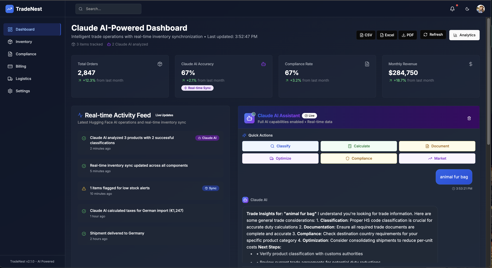
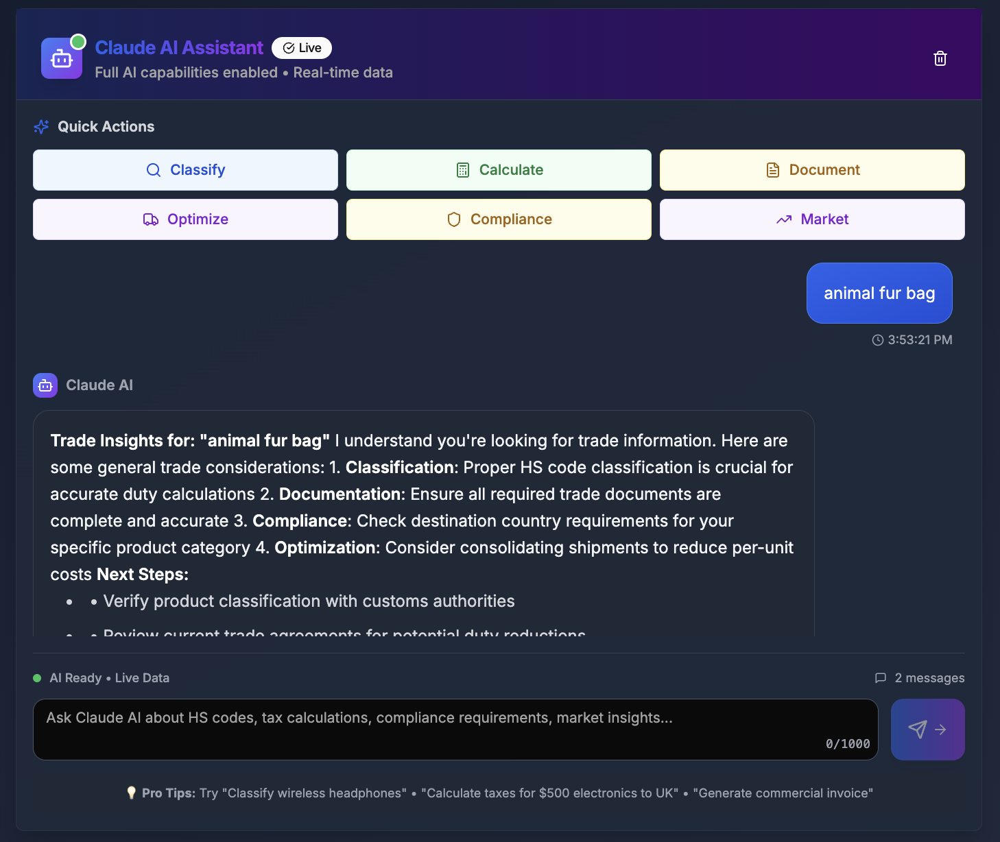

# Walmart Sparkthaon – AI-Powered Supply Chain & Trade Management Platform

A comprehensive, AI-driven platform built for Walmart Sparkthaon to streamline supply chain, inventory, compliance, billing, and logistics operations. Built with Next.js, React, and Claude AI, this project demonstrates modern, secure, and scalable trade management for global enterprises.

---

## Overview

Walmart Sparkthaon Submission: This project is designed to empower Walmart’s supply chain and trade management with AI-powered automation, real-time analytics, and seamless user experience. It covers inventory, compliance, billing, logistics, and more, all in a unified dashboard.

---

## Features

- **AI Assistant**: Claude AI-powered chat for trade insights, compliance, and analytics
- **Smart Inventory Management**: Real-time tracking, CSV upload, AI-based categorization
- **Automated Compliance**: Document generation, regulatory checks, risk assessment
- **Intelligent Billing**: Automated tax/duty calculations, multi-country support
- **Advanced Logistics**: Global shipment tracking, route optimization, warehouse analytics
- **Customizable Dashboard**: Widget-based, user-personalized interface
- **Enterprise Security**: Encrypted data, secure API key management

---

## User Interface Screenshots

> _Add screenshots of your dashboard, AI assistant, inventory upload, compliance, billing, and logistics pages here._

- 
- 
- 

---

## Project Structure

```
walmarthack/
├── app/                  # Next.js app directory
│   ├── (dashboard)/      # Dashboard routes (billing, compliance, etc.)
│   ├── globals.css       # Global styles
│   ├── layout.tsx        # Root layout
│   └── page.tsx          # Landing page
├── components/           # Reusable React components
│   ├── ui/               # UI primitives (shadcn/ui)
│   ├── ai-assistant.tsx  # AI chat interface
│   ├── csv-upload.tsx    # Inventory CSV upload
│   └── ...
├── lib/                  # Utility libraries (API, AI, store, etc.)
├── hooks/                # Custom React hooks
├── public/               # Static assets (add screenshots here)
├── README.md             # Project documentation
└── ...
```

---

## Prerequisites

- Node.js 18+
- pnpm (recommended) or npm/yarn
- Claude AI API key (from Anthropic)

---

## Getting Started

1. **Clone the repository**
   ```bash
   git clone https://github.com/aaryann20/Walmart-Hackathon-.git
   cd walmarthack
   ```
2. **Install dependencies**
   ```bash
   pnpm install
   ```
3. **Set up environment variables**
   ```bash
   cp .env.example .env.local
   # Add your API keys to .env.local
   ```
4. **Run the development server**
   ```bash
   pnpm dev
   # or: npm run dev
   ```
5. **Open your browser**
   Go to [http://localhost:3000](http://localhost:3000)

---

## How It Works

- **AI Assistant**: Integrates with Claude AI for natural language queries, compliance checks, and analytics.
- **Inventory**: Upload CSVs, get AI-powered categorization and demand analysis.
- **Compliance**: Automated document generation and regulatory checks.
- **Billing**: Real-time tax/duty calculations using AI.
- **Logistics**: Track shipments, optimize routes, and analyze warehouse data.

---

## Architecture

- **Frontend**: Next.js 13, React 18, TypeScript, Tailwind CSS
- **AI Integration**: Claude AI (Anthropic)
- **Deployment**: Vercel
- **Component Library**: shadcn/ui

---

## Low Level Design (LLD)

- **Component-based UI**: Modular React components for dashboard, widgets, and forms
- **State Management**: React state/hooks, custom inventory store
- **API Layer**: `lib/api-service.ts` for backend/API calls
- **AI Layer**: `lib/claude.ts` for Claude AI integration
- **CSV Handling**: `components/csv-upload.tsx` for inventory import

---

## System Architecture Diagram

> _Add your system architecture diagram here (e.g., using Mermaid, draw.io, or an image in /public)._ 

```
flowchart TD
    User["User"] --> UI["Next.js UI"]
    UI --> API["API Service Layer"]
    API --> Claude["Claude AI"]
    API --> DB["(Optional) Database"]
    UI --> Vercel["Vercel Hosting"]
```

---

## Class Relationships

- **Dashboard**: Composes widgets (inventory, compliance, billing, logistics)
- **AI Assistant**: Consumes user input, calls Claude API, returns insights
- **Inventory Store**: Central state for inventory data, used by multiple components
- **CSV Upload**: Parses and updates inventory store

---

## Component Details

- **ai-assistant.tsx**: Chat interface for Claude AI
- **csv-upload.tsx**: Inventory CSV import and parsing
- **dashboard-widget.tsx**: Reusable dashboard widget container
- **header.tsx/sidebar.tsx**: Navigation and layout
- **theme-toggle.tsx**: Light/dark mode switch
- **ui/**: Shadcn UI primitives (buttons, dialogs, etc.)

---

## Security Considerations

- API keys stored in environment variables, never in code
- Secure API calls with HTTPS
- No sensitive data stored in client-side code
- Follows best practices for React/Next.js security

---

## Deployment

- **Production build**:
  ```bash
  pnpm build
  pnpm start
  ```
- **Deploy to Vercel**:
  - Connect your repo to Vercel
  - Set environment variables in Vercel dashboard
  - Deploy with one click

---

## Contributing

1. Fork the repository
2. Create a new branch (`git checkout -b feature/your-feature`)
3. Commit your changes (`git commit -am 'Add new feature'`)
4. Push to the branch (`git push origin feature/your-feature`)
5. Open a Pull Request

---

## License

This project is licensed under the MIT License. See [LICENSE](LICENSE) for details.
